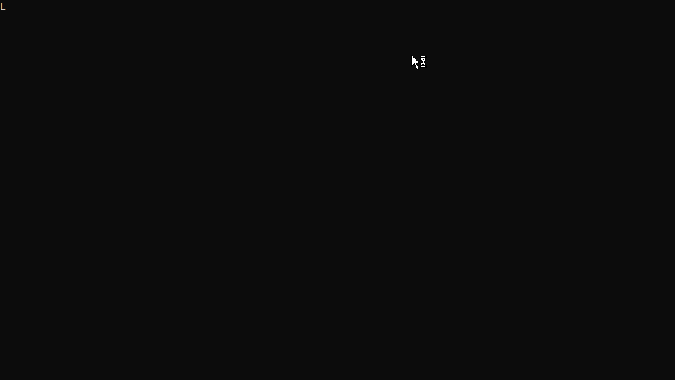

## Test de dactylographie

#### Principe

Le but de ce test est de mesurer la vitesse de frappe d'un utilisateur et ses erreurs. Le test consiste à reproduire un texte affiché à l'écran. L'utilisateur doit reproduire le texte en respectant la casse et la ponctuation. Lorsque l'utilisateur a reproduit le texte, il peut appuyer sur la touche Entrée pour afficher le bloc suivant. Lorsque tous les blocs ont été affichés, le test est terminé et le score est affiché ainsi que sauvegardé dans un fichier.

---

